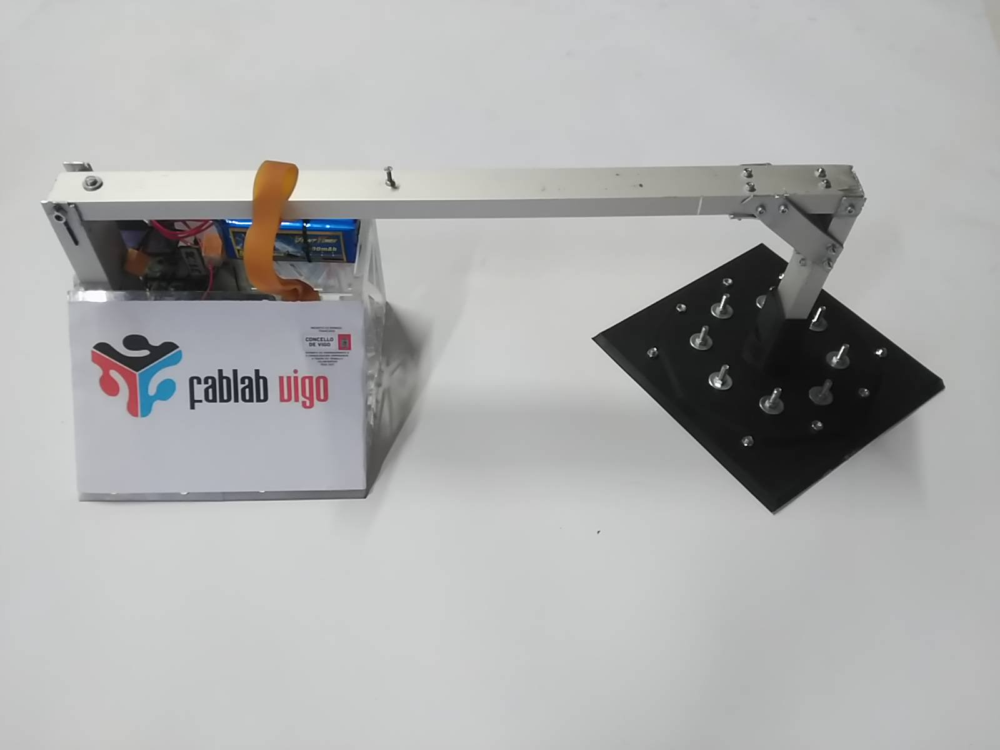
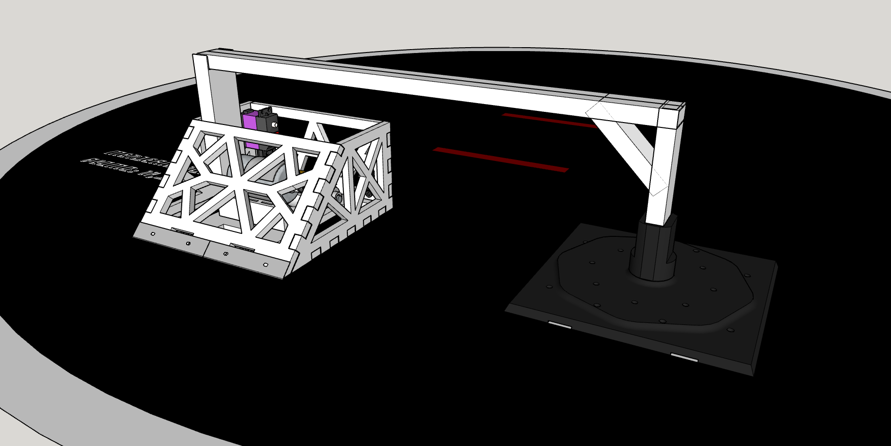

# EustassKidBot

Prototipo de robot de megasumo con imanes. La idea era que el brazo se pegase al dohyo mientras el cuerpo principal girase a alta velocidad.

## Hardware
- Arduino Nano
- Driver de motores desconocido
- Motor de altas rpm con transmisión por correa
- Servo JX CLS6027 para accionar el brazo
- LiPo 3S
- Imanes circulares de specs desconocidas
- Doble cuchilla de rascador de 10mm
- Chasis de metacrilato

## Software
- Programado con VS-Code y PlatformIO
- Funcionamiento básico de accionar servo y acelerar a máxima velocidad